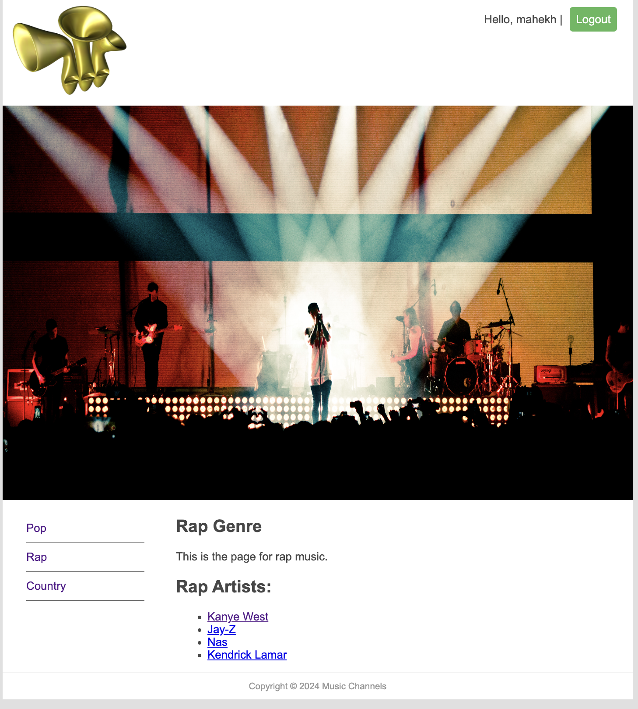

# 2024 CA229 Project02

## Name
Mahek and A'Yanna's Artist by Genres Youtube Channel

## Description
This is our Django website for CA229 group project 2. Our website is a Youtube Channel that has the three most popular genres and within those 3 genres (pop, country, rap) it has the four of our top 4 favorite artists and each of their most famous/our favorite youtube videos. The artists in pop are Katy Perry, Selena Gomez, Taylor Swift, and Britney Spears. The artists in rap are Kanye West, Nas, Jay-Z, and Kendrick Lamar. The artsits in country are Luke Bryan, Zach Bryan, Luke Combs, and Thomas Rhett. This is mainly in our [Genres](simple_test_project01/simple_test_root/Genres). We also have a login/logout and user authentication who wants to add more videos to each artsit they like which is mainly in the [views.py](simple_test_project01/simple_test_root/Genres/views.py)

## Visuals - Main Genres Menu Page
A screenshot of our genres menu page can be seen below: 

## Installation
To install our project, follow these steps:
1. Clone this repository.
2. Navigate to the project directory.
3. Install dependencies with `pip install django` and `pip install Pillow`.
4. Run migrations with `python manage.py makemigrations` and `python manage.py migrate`.

## Usage
To run the project locally, execute `python manage.py runserver` and visit `http://localhost:8000/Genres` in your browser.

## Support
If you have any issues with our website please feel free to contact us at any of our emails below:
- mahek.hemani2@mail.dcu.ie
- ayanna.rouse2@mail.dcu.ie

## Roadmap
We are very happy with our website design and features!

## Contributing
We are currently not open to contribution.

## Authors and acknowledgment
This project was created and designed by:
- A'Yanna Rouse
- Mahek Hemani

## Project status
The project is nearing completion and is currently in the final testing phase.
